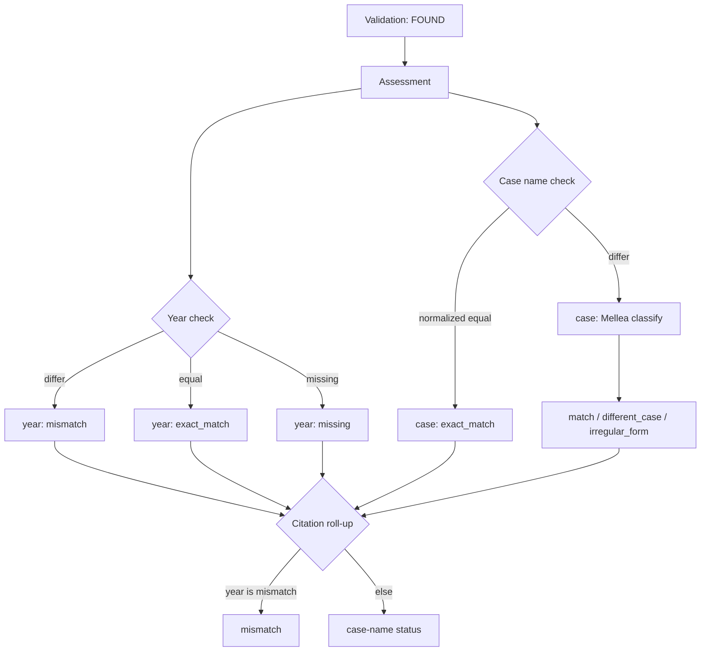

# Assessment Model Development

Assessment runs after [validation](./Validation%20Model%20Development.md) on citations that CourtListener marked `found`. It compares extracted bibliographic fields against the retrieved cluster record.

Inputs per citation:

| Source | Fields used |
|---|---|
| Extraction | plaintiff, defendant (→ case name), year |
| CourtListener cluster | `case_name`, `date_filed` (year = first four characters) |

Assessment has two independent checks. The citation-level status rolls them up with one override rule.

## Flow



## Roll-up rules

1. **Year mismatch wins.** If `year_assess.status` is `mismatch`, the citation status is always `mismatch`, regardless of the case-name verdict.
2. **Otherwise**, the citation status mirrors the case-name verdict (`exact_match`, `match`, `irregular_form`, `different_case`, or `needs_assessment`).
3. **Year missing** does not downgrade the roll-up; it stays on the case-name verdict and is surfaced on `year_assess` only.

Case-name `exact_match` normalizes typographic quotes, dashes, and whitespace before comparing strings. Mellea is called only when normalized equality fails and both names are present.

## Outputs

Each citation produces a `CitationAssessment` with:

- `status` — rolled-up citation verdict (includes year mismatch)
- `case_assess` — case-name field assessment
- `year_assess` — year field assessment

Document-level JSON summaries keep these dimensions separate:

- `counts` — citation-level roll-up status counts
- `case_name_counts` — case-name field status counts
- `year_counts` — year field status counts

Re-extraction (`irregular_form` → corrected parties → reassessment) updates `case_assess` only; year mismatch still overrides the final roll-up.

## DeepSeek Official Structured Output

When `MELLEA_LRC_LLM_PROVIDER=deepseek`, assessment uses the official DeepSeek API with model `deepseek-v4-pro`.

DeepSeek's documented final-message structured output mode is **JSON Output**:

- request parameter: `response_format: {"type": "json_object"}`
- prompts must explicitly ask for JSON and include the expected JSON shape
- `max_tokens` must be large enough to avoid truncating the JSON object

The official chat-completion docs list `response_format.type` values as `text` and `json_object`. They do not document OpenAI-style final-message `json_schema` as a supported response format, so the DeepSeek path uses JSON Output plus local validation/parsing instead of Mellea's JSON Schema response format.

## Resampling And Telemetry

Case-name classification uses Mellea `RejectionSamplingStrategy(loop_budget=3)`.
This gives Mellea a chance to retry malformed or requirement-failing structured
outputs before the assessment fails.

The classification response schema is small (`{"result": ...}`), but reasoning
models may spend completion budget before emitting final JSON. The classifier
therefore uses a 2048-token completion budget to avoid empty final content from
providers that count reasoning tokens against `max_completion_tokens`.

Mellea also documents OpenTelemetry sampling signals:

- metrics: `mellea.sampling.attempts`, `mellea.sampling.successes`, `mellea.sampling.failures`
- trace attributes: `mellea.num_generate_logs` and `mellea.sampling_success`

Those telemetry signals are emitted through Mellea's OpenTelemetry integration.
The installed Mellea package does not expose sampling hook objects as a stable
local API in this project, so the artifact summary does not yet include an
in-process resampling rate. If we enable an OTLP backend, the desired rate is:

```text
resampling_triggered_rate = count(mellea.num_generate_logs > 1) / count(semantic_assessments)
```
