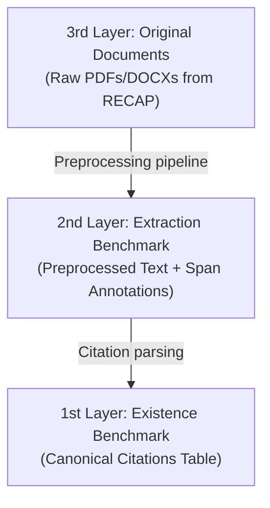

# Benchmark Dataset Architecture

This document describes the three-layered architecture of our benchmark dataset for detecting AI hallucinations in legal documents. **The key idea is to decouple extraction from validation so that each component can be evaluated independently.**

---

## The Three-Layer Design

Our benchmark is structured around three layers, each corresponding to a distinct dataset and a distinct stage of processing.

### 3rd Layer — Original Documents (Raw Files)
- **Content**: Court filings in their original format (PDF or DOCX), scraped from the RECAP/PACER system.
- **Labels**: None. These are the immutable source reference.
- **Purpose**: Serves as the ground truth source material — real-world briefs in which AI-hallucinated citations were detected in the wild.

### 2nd Layer — Extraction Benchmark (Preprocessed Text)
- **Content**: Text-based documents produced by running the 3rd layer files through our preprocessing pipeline.
- **Labels**: Annotated citation spans (character-level offsets), regardless of whether citations are real or hallucinated.
- **Purpose**: Evaluating the extraction model's ability to locate citation strings in unstructured legal text.

### 1st Layer — Existence Benchmark (Canonical Citations)
- **Content**: A structured table of deduplicated, canonical citation representations (volume, reporter, page, year, party names, etc.).
- **Labels**: `Real` or `False` per citation.
- **Purpose**: Evaluating the validation engine's ability to verify citation authenticity, independent of document formatting or extraction quality.

---

## Decoupling Extraction and Validation

Each layer maps to a distinct evaluation task:

- **Extraction** is evaluated on the 2nd layer: given preprocessed text, how well do we locate citation spans and identify bibliographic data?
- **Validation** is evaluated on the 1st layer: given a canonical citation, is it real or hallucinated?

For now, these two phases are decoupled. This fits the problem statement from IBM and keeps development simpler. We may want to add more coupling later, perhaps introducing a feedback loop to improve the performance of both tasks.

---

## The 2nd Layer Is Defined by the Preprocessing Pipeline

**The 2nd layer benchmark is always the output of whatever preprocessing pipeline we apply to the 3rd layer.** This means improving the preprocessing pipeline can improve extraction performance even without any change to the extraction model itself — better preprocessing gives cleaner text, and cleaner text gives better extraction.

The flip side is that **any change to the preprocessing pipeline invalidates existing span annotations**, since character offsets are tied to the exact text output. This has direct consequences for our annotation strategy — see [Extraction Model Development](Extraction%20Model%20Development.md).

---

## Dataset Status

- **Labeling server**: A Label Studio instance is hosted at [annotate.woodygoodenough.com](https://annotate.woodygoodenough.com/). Team members can register to begin annotating.
- **Current focus**: Improve the 2nd layer as we develop extraction. We preprocess RECAP PDFs with Docling + Tesseract CLI OCR; see [Preprocessing Development](./Preprocessing%20Development.md).
- **Data source**: See [Data Source](./Data%20Source.md) for details on the RECAP/CourtListener pipeline.
