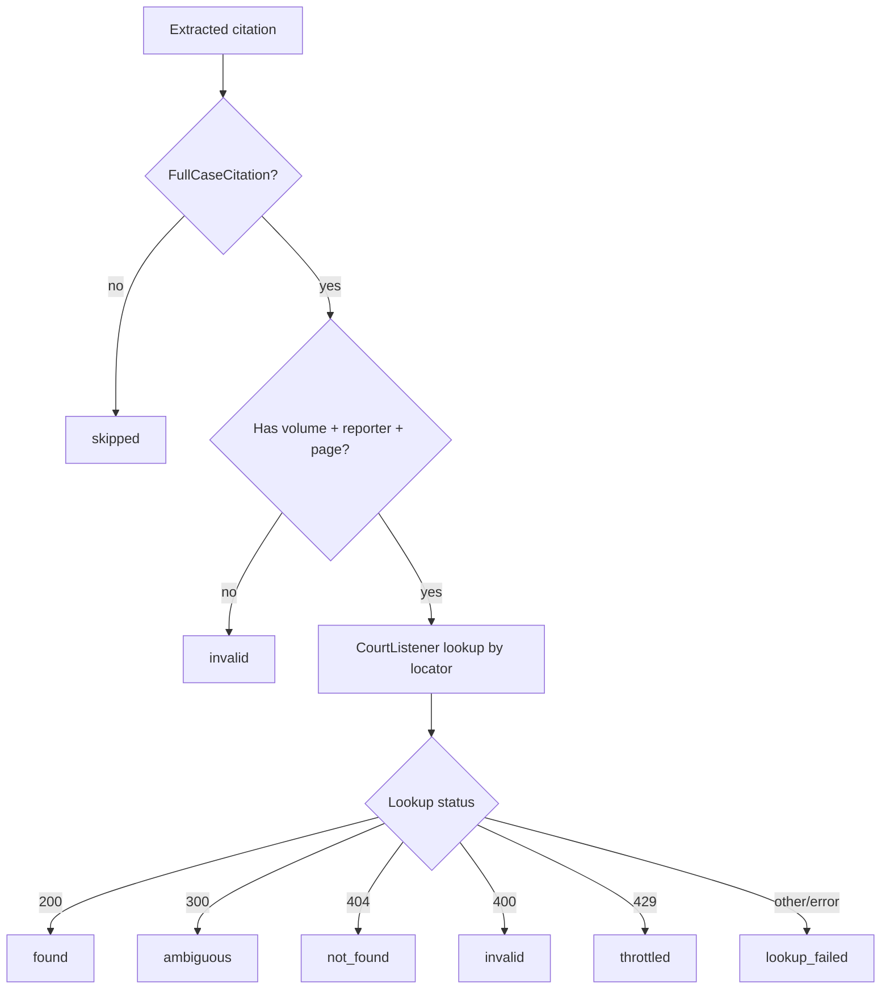

# Validation Model Development

The validation model operates on the **1st layer** of our benchmark: a structured table of canonical citations, each labeled `Real` or `False`. It verifies citation claims independently of where or how the citation appeared in the source document.

We develop the validation model in three layers of increasing scope. Each layer builds on the previous one.

---

## Layer 1 — Existence Check

The first question is simply: does this case exist?

To answer it, we only need the **citation locator** — the minimum set of fields that uniquely identifies a case in a reporter system. For a `FullCaseCitation`, this is:

| Field | Example |
|---|---|
| volume | `531` |
| reporter | `U.S.` |
| page | `98` |

These three fields together (`531 U.S. 98`) are sufficient to retrieve a specific case from a reporter-indexed database. Other fields like party names or year are not needed for lookup — they are for cross-reference in Layer 2.

### Implemented Validation Flow



The validation output is a `CitationValidation` record. It preserves the original
lookup status, cache/key metadata, error message, typed failure detail, and typed
`CitationMatch` records converted from returned CourtListener clusters. Unknown
upstream fields are retained separately as immutable `extra_data`.

### Formal Statuses

The implemented status vocabulary is:

- `found` — CourtListener returned one found citation result (`200`)
- `ambiguous` — CourtListener returned multiple choices (`300`)
- `not_found` — CourtListener did not find the locator (`404`)
- `invalid` — the extracted citation is missing locator fields, or CourtListener rejected it (`400`)
- `throttled` — CourtListener or the deployed access service reported rate limiting (`429`)
- `lookup_failed` — any other lookup failure
- `skipped` — citation kind is not validated by the Layer 1 full-case existence check

Yes: throttling is represented formally as `ValidationStatus.THROTTLED`, serialized
as `throttled`. When available, rate-limit/error data is validated and converted to
`ValidationFailureDetail`; unmodeled fields remain in its `extra_data`.

### CourtListener API

The primary lookup target is CourtListener, which provides a REST API for querying its case law database. A citation lookup can be done against the clusters endpoint, filtering by reporter citation. CourtListener covers federal and state appellate cases and is our most reliable programmatic source.

See [Data Source](./Data%20Source.md) for details on CourtListener's coverage and how it aggregates from RECAP, Case.law, and court websites.

### Fallback for Coverage Gaps
Even for this first layer, there are nuances: a citation may fail the CourtListener lookup not because it is hallucinated, but because the document was never uploaded to RECAP. We need to handle this ambiguity carefully and avoid treating a coverage gap as a negative label.

CourtListener's coverage is strong for appellate-level cases but incomplete for others — see Data Source for the full picture. For citations that do not resolve via the CourtListener API, we need a fallback. The most practical option at this stage is a web search using the citation locator as a query. This is less reliable and harder to verify programmatically, but it extends our reach to cases that have not reached the appellate level or are otherwise missing from CourtListener.

---

## Layer 2 — Bibliographic Cross-Reference

A hallucinated citation may reference a real case but get the metadata wrong — wrong party names, wrong year, wrong court. This is a distinct failure mode from pure invention, and the existence check alone will not catch it.

Layer 2 uses the case retrieved in Layer 1 to verify the remaining fields in the canonical representation:

- Do the party names match?
- Is the year consistent with the court's records?
- Is the court field correct?
- Is the pin cite within the page range of the actual opinion?

**The scope of this layer is explicitly bounded to the canonical citation representation.** We check what can be checked from the structured fields we extracted — nothing more. Any check that requires reading the content of the cited document or the source document belongs to Layer 3.

### Court field assessment

Validation only retrieves the CourtListener court — it never compares it
against anything. Court assessment is where the comparison happens: it
compares the **raw eyecite** ``court`` slug against the CourtListener court
resolved during validation. When that initial comparison is ``missing`` and
the reporter unambiguously identifies SCOTUS (``L. Ed.`` / ``L. Ed. 2d`` gaps
in eyecite), assessment applies **reporter inference** as a field-local
follow-up — mirroring the case-name ``initial`` + ``followup`` trace.

Implementation: ``assessment/fields/court/assess.py`` (`assess_court`),
``assessment/fields/court/inference.py``. Trace shape: ``CourtAssessmentRun``
with ``CourtInferredFromReporter`` follow-up.

Extraction and validation do **not** apply this fallback, and validation never
flags a missing comparison — there is nothing to flag when no comparison is
attempted. Assessment is where we express the opinion that ``L. Ed. 2d``
implies ``scotus``.

#### Reporter table (eyecite 2.7.x, clean text)

| Reporter | Example | eyecite `court` | assessment inference? |
|---|---|---|---|
| `U.S.` | `347 U.S. 483` | `scotus` | No — initial `exact_match` |
| `S. Ct.` | `123 S. Ct. 456` | `scotus` | No |
| `L. Ed.` | `123 L. Ed. 456` | *(absent)* | Yes — follow-up `inferred_from_reporter` |
| `L. Ed. 2d` | `123 L. Ed. 2d 789` | *(absent)* | Yes |
| `F.3d` | `38 F.3d 1225` | varies | No — ambiguous reporter |

#### Example — `L. Ed. 2d`

```
Extraction:   court=None, reporter="L. Ed. 2d"
Validation:   extracted_court=None vs CL "scotus" → missing_extracted
Assessment:   initial=missing → followup inferred_from_reporter → result=exact_match
```

---

## Layer 3 — Contextual Verification

Layer 3 goes beyond what is available in the canonical representation. It asks whether the citation is used correctly in context.

The clean boundary between Layer 2 and Layer 3 is: **does the check require input that is not in the canonical citation representation?** If yes, it belongs here.

Some checks in this layer are relatively objective:

- Does a quoted passage actually appear in the cited opinion?
- Is a statute cited for a subsection that exists?
- Is the case designated as non-precedential, and is it cited as if it were binding?

Others are more subjective and harder to automate:

- Is the legal proposition for which the case is cited actually supported by that case?
- Is the case applied in the right legal context?

Even within this layer, there is a spectrum of implementability. Some sub-tasks we can approach with reasonable confidence; others may require significant effort or are better left as open problems. For the harder cases, our goal may be to provide the relevant retrieved context as structured output so that downstream projects or more capable models can carry the analysis further.

---

## Summary

| Layer | Input | Question |
|---|---|---|
| 1 — Existence | volume + reporter + page | Does this case exist? |
| 2 — Bibliographic | full canonical representation | Are the metadata fields correct? |
| 3 — Contextual | canonical + document context | Is the citation used correctly? |

Our current development focus is Layer 1 and Layer 2. Layer 3 is in scope but lower priority, and some sub-tasks within it may be designed as interfaces for downstream use rather than fully implemented features.
