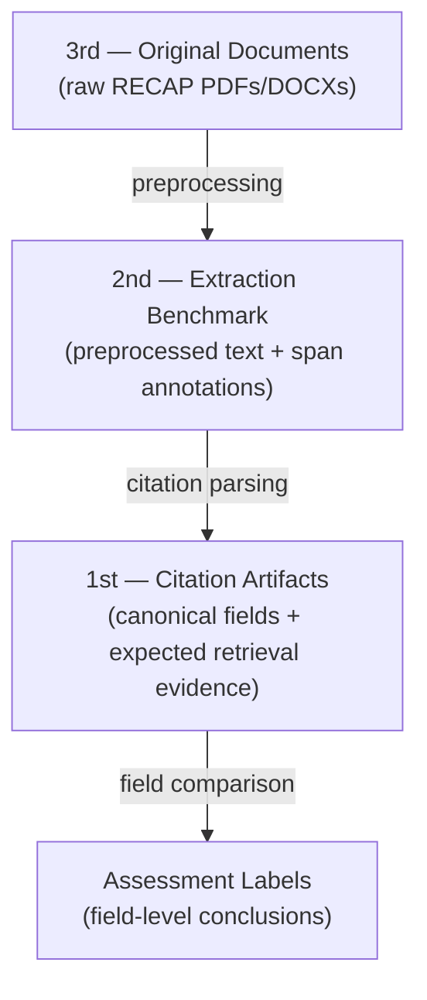

# Benchmark Dataset Architecture

The benchmark separates source documents, extraction annotations, retrieval
expectations, and assessment labels so each phase can be evaluated without
blurring its responsibility.

- **3rd layer** — immutable source filings scraped from RECAP/PACER. No labels.
- **2nd layer** — preprocessed text with character-level citation span annotations. Evaluates **extraction** (locating/classifying citation spans).
- **1st layer** — deduplicated canonical citations (volume, reporter, page,
  parties, year…) with expected retrieval states and source evidence. This
  evaluates whether validation faithfully retrieves and records evidence; it
  does not ask validation to declare a citation real or false.
- **Assessment labels** — field-level conclusions grounded in an extracted
  citation and retrieved candidate. These evaluate comparison and opinionated
  behavior separately from retrieval.

Extraction, validation, and assessment remain separately measurable. See
[Validation Development](./validation/index.md) for the non-opinionated
retrieval contract and [Assessment Development](./assessment/index.md) for
field-level conclusions.

## The 2nd layer is defined by the preprocessing pipeline

The 2nd layer is always the output of whatever preprocessing we run on the 3rd layer, so improving preprocessing improves extraction with no model change. The cost: **any preprocessing change invalidates existing span annotations** (offsets are tied to exact text) — see [Extraction Model Development](./Extraction%20Model%20Development.md).
