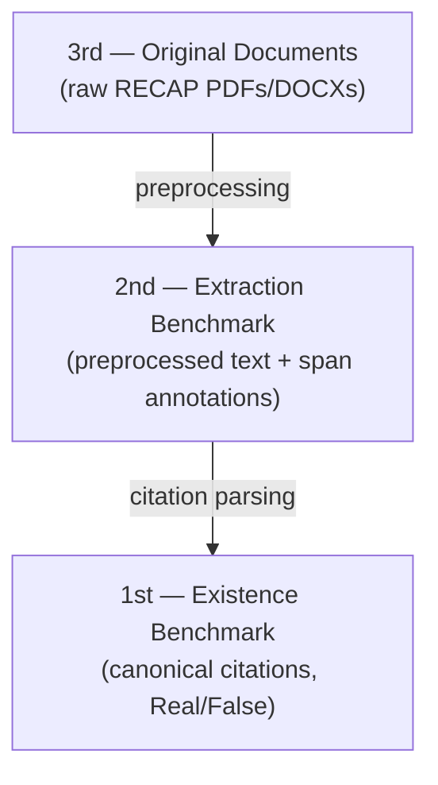

# Benchmark Dataset Architecture

Three layers, so extraction and validation can be evaluated independently.

- **3rd layer** — immutable source filings scraped from RECAP/PACER. No labels.
- **2nd layer** — preprocessed text with character-level citation span annotations. Evaluates **extraction** (locating/classifying citation spans).
- **1st layer** — deduplicated canonical citations (volume, reporter, page, parties, year…), each labeled `Real`/`False`. Evaluates **validation** (is the citation real?).

Extraction and validation are decoupled for now (simpler; matches the IBM problem statement). A feedback loop between them is possible later.

## The 2nd layer is defined by the preprocessing pipeline

The 2nd layer is always the output of whatever preprocessing we run on the 3rd layer, so improving preprocessing improves extraction with no model change. The cost: **any preprocessing change invalidates existing span annotations** (offsets are tied to exact text) — see [Extraction Model Development](./Extraction%20Model%20Development.md).

## Status

- **Annotation**: Label Studio instance at [annotate.woodygoodenough.com](https://annotate.woodygoodenough.com/).
- **Current focus**: grow the 2nd layer as extraction develops; RECAP PDFs preprocessed with Docling + Tesseract CLI OCR — see [Preprocessing Development](./Preprocessing%20Development.md).
- **Source pipeline**: [Data Source](../knowledge/Data%20Source.md).
