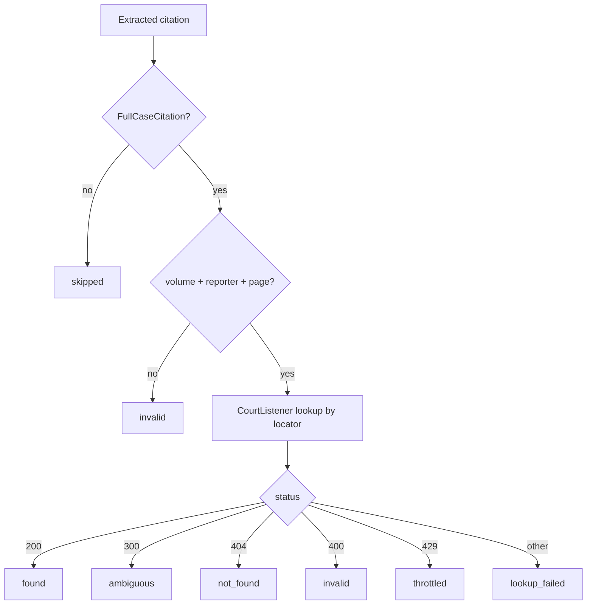

# Validation Model Development

Validation operates on the **1st layer**: canonical citations labeled `Real`/`False`, verified independently of the source document. Three layers of increasing scope; current focus is Layers 1–2.

| Layer | Input | Question |
|---|---|---|
| 1 — Existence | volume + reporter + page | Does this case exist? |
| 2 — Bibliographic | full canonical representation | Are the metadata fields correct? |
| 3 — Contextual | canonical + document context | Is the citation used correctly? |

## Layer 1 — Existence

The locator (`volume`, `reporter`, `page`, e.g. `531 U.S. 98`) is enough to look a case up in CourtListener; other fields are for Layer 2. The pipeline is deterministic (no LLM):

Each outcome is a `CitationValidation` variant preserving lookup status, cache/key, error/`ValidationFailureDetail`, and typed `CitationMatch` records; unmodeled upstream fields stay in `extra_data`. Statuses: `found`, `ambiguous`, `not_found`, `invalid`, `throttled`, `lookup_failed`, `skipped`.

**Principle: validation retrieves, it never compares.** It resolves data (the CourtListener court, case-name search candidates) and attaches it; all comparison/opinion is assessment's job.

- CourtListener coverage and the RECAP pipeline: [Data Source](../knowledge/Data%20Source.md).
- **Not-found handling**: the shipped count-only fallback is described in
  [Not Found Candidate Search](./Not%20Found%20Candidate%20Search.md). Its planned
  replacement is the candidate-bearing, iterative
  [Not-Found Retrieval Agent](./Not-Found%20Retrieval%20Agent.md). A coverage gap
  is not the same as a hallucination; retrieval remains non-opinionated.
- **Ambiguous handling** (multiple clusters, HTTP 300): [Ambiguous Resolution](./Ambiguous%20Resolution.md). Validation returns all candidates; assessment runs the found-branch assessment on each (gated above 5).

## Layer 2 — Bibliographic cross-reference

Uses the case retrieved in Layer 1 to check the remaining canonical fields — party names, year, court, pin cite in range — nothing that requires reading document content (that is Layer 3).

### Court field assessment

Validation only *retrieves* the CourtListener court. The comparison lives in
assessment and begins with eyecite's raw `court` value. When that value is
missing and the reporter covers one court exclusively, reporter inference may
supply the citation court as a field-local extraction fallback. This fallback
can run even when CourtListener has no court; in that case comparison remains
`missing` and expresses no opinion.

The trace is `CourtAssessmentRun` with a
`CourtInferredFromReporter` follow-up. Implementation:
`assessment/fields/court/{assess,inference}.py`. The admission rule, implemented
mappings, eyecite coverage gaps, and deliberately excluded reporters live in
[Reporter-to-Court Inference](../knowledge/Reporter%20Court%20Inference.md).

## Layer 3 — Contextual verification (lower priority)

Checks requiring input beyond the canonical representation: does a quoted passage appear in the opinion; is a cited subsection real; is a non-precedential case cited as binding; is the proposition actually supported. The harder, subjective cases may ship as structured retrieved context for downstream use rather than fully automated verdicts.
