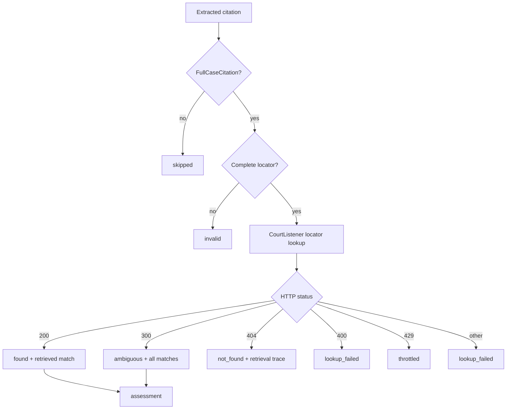

# Validation Development

Validation is the retrieval and provenance phase between extraction and
assessment. It attempts to resolve each extracted citation against an external
source and records exactly what happened.

> [!IMPORTANT]
> Validation does **not express an opinion** about whether a citation is real,
> correct, hallucinated, or used appropriately. A lookup result is evidence, not
> a verdict. Comparison and conclusions belong to
> [assessment](../assessment/index.md).

This boundary applies to every validation path:

- `found` means CourtListener returned one record for the locator; it does not
  mean every extracted field is correct.
- `ambiguous` means CourtListener returned multiple records; validation retains
  them without choosing or collapsing candidates.
- `not_found` means the bounded lookup returned no record; it does not mean the
  cited authority does not exist.
- resolved court data and search results are attached as retrieved facts. They
  are never compared with extracted values here.

## Current pipeline

Validation currently accepts complete case citations and performs an exact
CourtListener lookup using the locator fields `volume`, `reporter`, and `page`.
It is deterministic and makes no LLM calls.

Every citation produces one `CitationValidation` variant. The artifact keeps
the citation ID, lookup source and status, cache/key metadata, typed matches,
errors, and unmodeled upstream fields in `extra_data`. Run-level provenance is
stored in `ValidationMetadata`.

## Field and path documentation

- [Locator lookup](./locator.md) — exact retrieval using volume, reporter, and
  page.
- [Court retrieval](./court.md) — resolving the CourtListener-side court without
  comparing it to the extracted court.
- [Not-found candidate search](./not-found-candidate-search.md) — shipped
  count-only fallback after a 404.
- [Not-found retrieval agent](./not-found-retrieval-agent%20%5Bin%20progress%5D.md) — planned bounded,
  candidate-bearing retrieval.
- [Not-found retrieval sources](../../knowledge/Not-Found%20Retrieval%20Sources%20%5Bin%20progress%5D.md)
  — research and escalation hierarchy for coverage gaps.

Candidate selection and all field comparisons are documented under
[Assessment Development](../assessment/index.md). CourtListener coverage limitations
are documented in [Data Source](../../knowledge/Data%20Source.md).

## Adding validation work

New validation behavior should return source-grounded data and an execution
trace. It may normalize a request or resolve an external identifier when needed
to retrieve evidence. It must not:

- emit match/mismatch, real/false, correct/incorrect, or hallucination labels;
- select the “right” candidate from competing records;
- silently correct or mutate the extracted citation; or
- turn missing external data into a negative conclusion.

If a feature needs any of those operations, preserve the retrieval artifact and
implement the opinion in assessment.
