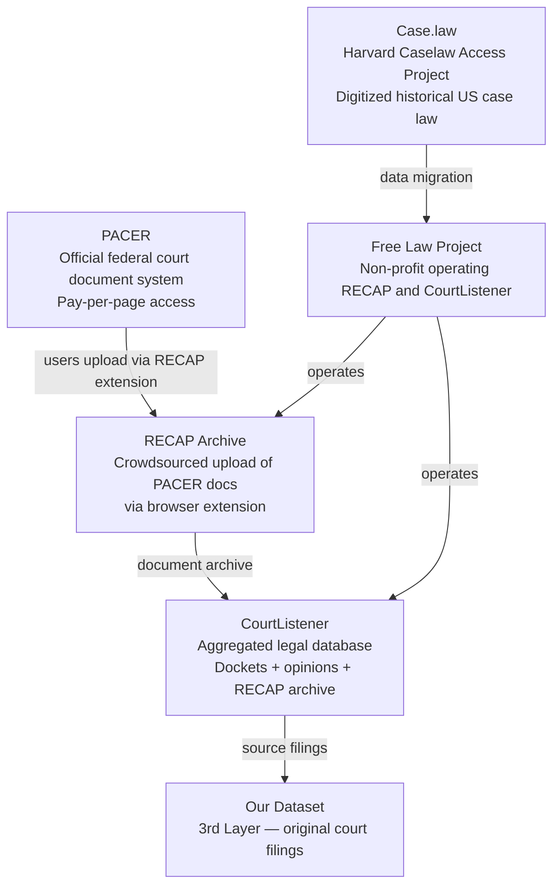

# Data Source

Our 3rd layer dataset consists of real court filings in which AI-hallucinated citations were detected in the wild. 

---

## The Ecosystem

### PACER
PACER (Public Access to Court Electronic Records) is the official federal court document system. It indexes dockets and documents for all federal cases and charges per page to download. It is the authoritative source for federal court filings, but access is gated behind per-document fees.

### RECAP and the Free Law Project
RECAP is a browser extension developed by the Free Law Project. When a user downloads a document from PACER, the extension automatically uploads a copy to the RECAP archive hosted on CourtListener, making it freely available. RECAP is essentially a crowdsourced mirror of PACER.

Importantly, **RECAP only contains documents that someone has already downloaded from PACER**. The docket entry (metadata) may exist in CourtListener even if no one has ever uploaded the actual PDF. This is a key source of availability gaps.

### Case.law (Harvard Caselaw Access Project)
Case.law is a Harvard Law School initiative that digitized published US case
law from physical reporters. This data has since been incorporated and
normalized by the Free Law Project and is now accessible via CourtListener. It
is a historical case-law source rather than a live docket feed. Its center of
gravity is published appellate case law, but reported trial and special-court
decisions can also occur; it must not be modeled as categorically
“appellate-only.”

### CourtListener
CourtListener is the Free Law Project's main platform. It aggregates data from
multiple sources: the RECAP archive, incorporated Case.law data, direct
scraping of court websites, court publishing partnerships, and bulk data
contributions. Its case-law database includes federal and state courts at
multiple levels, but coverage is strongest for published appellate decisions.
Its RECAP database separately covers federal PACER dockets and filings.

CourtListener is our primary access point for sourcing the original court filings in our dataset.

CourtListener uses a unified `Docket` object across its collections. In PACER/
RECAP data, a docket can own docket entries, parties, attorneys, and documents.
In case-law data, including incorporated Harvard Caselaw Access Project records,
the docket instead sits above opinion clusters and opinions. A state appellate
docket can therefore be a valid source of case and court metadata without
having any docket entries. This distinction controls our retrieval path: use
the docket referenced by a found opinion cluster to obtain `court_id`; do not
require RECAP coverage or docket-entry availability.

For the search endpoint contract, supported corpora, semantic-search behavior,
and project-specific usage guidance, see [CourtListener Search API](CourtListener%20Search%20API.md).
For the court-level taxonomy, human-readable inference signals, and
level-specific coverage strategy, see
[Court Level Classification](Court%20Level%20Classification%20%5Bin%20progress%5D.md).
For structured and official sources to try when exact CourtListener lookup
misses, see
[Not-Found Retrieval Sources](Not-Found%20Retrieval%20Sources%20%5Bin%20progress%5D.md).

---

## Why Some Documents Are Available and Others Are Not

Even within federal cases (which are the most comprehensively indexed), document availability is inconsistent. Several factors contribute:

**RECAP coverage depends on user behavior.** A docket may be fully indexed in CourtListener, but if no RECAP user ever purchased and uploaded a particular filing, the document itself will not be in the archive. The docket entry exists; the PDF does not.

**Some documents are sealed or restricted.** A judge may seal a filing or restrict access to certain parties. These documents will not appear in PACER at all, and therefore cannot reach RECAP.

**State cases are less consistently covered.** CourtListener indexes state appellate opinions, but trial-level state documents are largely absent. Coverage varies significantly by state and court.

**Published vs. unpublished opinions.** Many federal appellate decisions are designated "unpublished" and may not appear in traditional reporter services. Their presence in CourtListener depends on whether they were scraped directly from court websites or uploaded via RECAP.

---

## Implications for Our Dataset

Our 3rd layer dataset is sourced from RECAP/CourtListener and is therefore subject to all of the above constraints. The documents we have are real federal court filings where AI hallucinations were caught — but they represent a non-random sample of the broader filing population, shaped by who happened to download and share them via RECAP.

This is not a problem for our current benchmark goals, since we are not trying to build a representative sample of all federal filings. But it is worth keeping in mind when reasoning about the generalizability of our results.

As more users upload documents via RECAP, CourtListener grows continuously — meaning the pool of potential source documents for our dataset expands over time without any active effort on our part.
